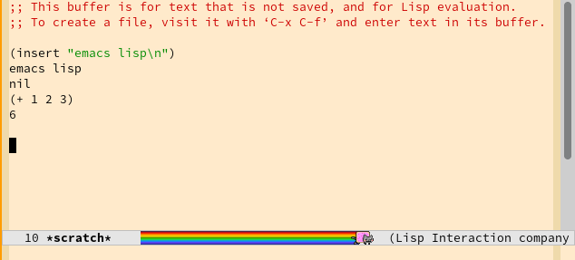
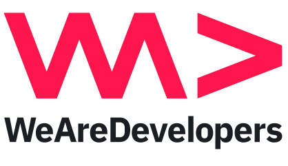
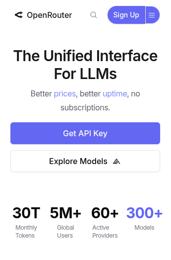
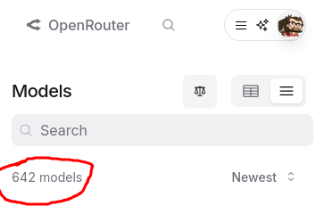
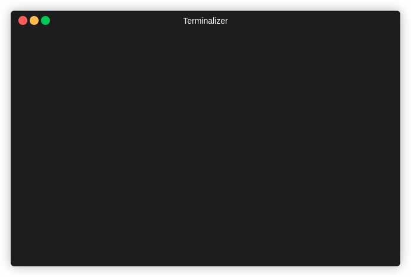

Openrouter

<!--
The last comment block of each slide will be treated as slide notes. It will be visible and editable in Presenter Mode along with the slide. [Read more in the docs](https://sli.dev/guide/syntax.html#notes)
-->

---

#0 EARLY AI HYPE

---

<div style="display:flex; align-items:center">


</div>

<!--

#0 ai hype

- archlinux, emacs, terminals -> my setup for the last 10yrs
- love control and knowing how things work
- love playing with cheap things (used thinkpads)
- using lots of opensource

-->

---

#0 EARLY AI HYPE

<div style="display:flex; align-items:center">

</div>

<!--

- didn't like the way how coding AIs are tightly integrated into editors
- didn't like subscriptions (they get worse overtime, see enshittyfication of streaming)

- at we-are-developers '25 (basically every 2nd talk was about AI)
- at yet another AI talk someone said: "just try out any model, typically they're super cheap"

-->

---

#1 TO THE RESCUE: the ai gateway

<div style="display:flex; align-items:center; justify-content:center">

</div>

<!--

- use any model you want, with any tool you want
- no SUBSCRIPTION required,
  - no virtual currency,
  - pay per token with,
  - prepaid cash balance

-->

---

#1 TO THE RESCUE: claude code cli

<div style="display:flex; align-items:center; justify-content:center">

</div>

<div style="gap: 10px; padding: 1rem; display:flex; flex-direction:column; align-items:center; justify-content:center">


</div>

<!--

- proved to be perfect for playing around in private projects (and at work)
- started using it with claude-code via https://github.com/musistudio/claude-code-router

-->

---

#1 TO THE RESCUE: claude-code-router

<div style="gap: 10px; padding: 1rem; display:flex; flex-direction:column; align-items:center; justify-content:center">

</div>

github.com/musistudio/claude-code-router

<!--

- to use claude code with other providers and models you need a proxy

-->

---

#1 TO THE RESCUE: openrouter.ai

<div style="gap: 10px; padding: 1rem; display:flex; flex-direction:column; align-items:center; justify-content:center">

</div>

<!--

- but it became too tedious switching models from within claude code

-->

---

#1 TO THE RESCUE: ~~codex cli~~

<!--

- when submitting this lightning talks 2 weeks ago I was trying codex
- did not get warm with it, felt to "magicky"
- still not easy enought to switch models

-->

---

#2 PI AGENT

<div style="gap: 10px; padding: 1rem; display:flex; flex-direction:column; align-items:center; justify-content:center">

</div>

<!--

- so I switched to "pi"
- put it in a docker jail first so it cannot mess with my non-project files

-->

---

#2 PI AGENT: good old security engineering

<div style="padding-left:0.2rem; font-size: 8px">
github.com/hoeck/caged-pie/blob/main/Dockerfile
</div>

```bash
FROM ubuntu:25.04

RUN apt-get update ...............

USER ubuntu

# install pi as a global command but keep it readable by itself
# also mount the npm path from an external path/volume so that its cached and
# writable by pi

ENV PATH="$PATH:/home/ubuntu/npm/bin"
RUN npm config set prefix /home/ubuntu/npm

# mount the current project here
RUN mkdir /home/ubuntu/project
WORKDIR /home/ubuntu/project

# run as non-root
CMD ["pi"]
```

---

#2 PI AGENT: switching models

<div style="display:flex; flex-direction:column; align-items:center; justify-content:center">

</div>

---

<!--
- switching models is dead easy
- OR provides up-to-date tokens-per-second for all models/providers
- PI reads OR data for accurate pricing
  (include cost screenshot)
- I learned to like the fast & cheap gemini flash models

- run your own experiments to verify what others say online ? easy !
  - commit context.md
  - run pi with different models / different agent setups in a git branch
  - compare results in git and costs from pi log

- pi agent fetches models from
- curl https://openrouter.ai/api/v1/models
- and https://models.dev/ - a database of models

check: https://github.com/badlogic/pi-mono/blob/main/packages/ai/scripts/generate-models.ts

-->

---

#3 alternatives to the alternative

<!--

- https://vercel.com/ai-gateway
- aws bedrock (more expensive than openrouter)
- cloudflare AI gateway

-->

---

#4 conclusion

<!--

i have spent way more time playing around with models and agents than actually doing useful coding

but it has been *fun* XD

-->

```

```

```

```

```

```
