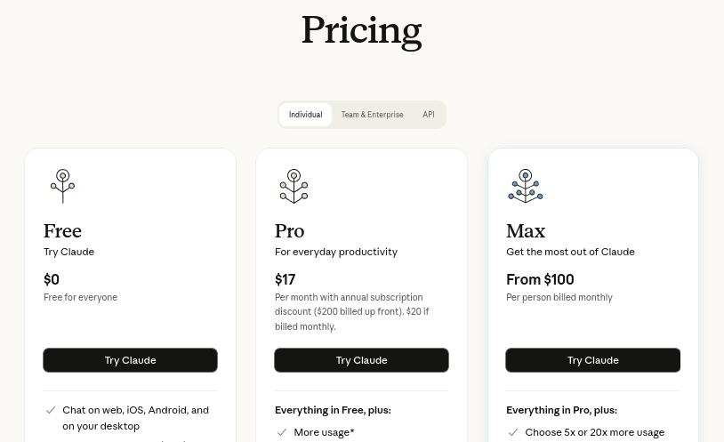
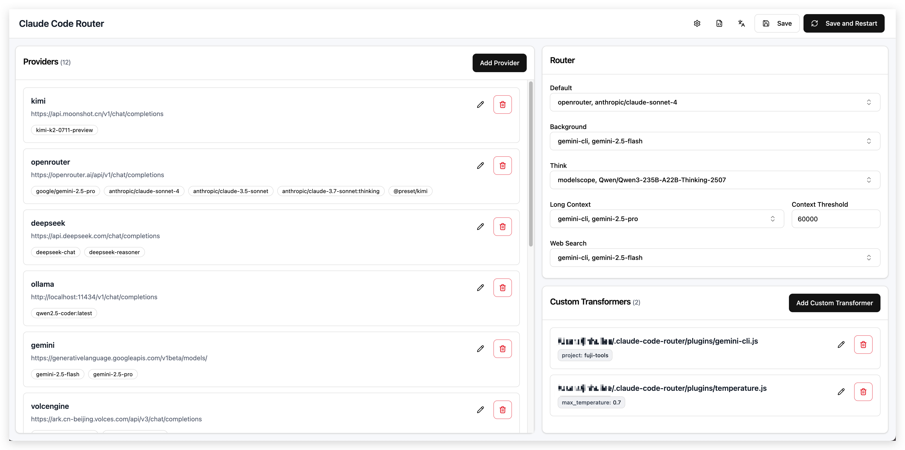
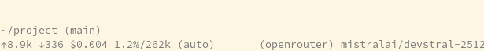

Openrouter

<!--
The last comment block of each slide will be treated as slide notes. It will be visible and editable in Presenter Mode along with the slide. [Read more in the docs](https://sli.dev/guide/syntax.html#notes)
-->

---

<div style="display:flex; align-items:center; padding:2rem; height:100%">
#0 EARLY AI HYPE
</div>

---

#0 EARLY AI HYPE: my happy little dev world

<div style="display:flex; align-items:center; justify-content:center; gap:1rem; padding:2rem;">


</div>

arch linux, emacs

<!--

- archlinux, emacs, terminals -> my setup for the last 10yrs
- love control and knowing how things work
- love playing with cheap things (used thinkpads)
- using lots of opensource

-->

---

#0 EARLY AI HYPE: 2025

<div style="display:flex; align-items:center; justify-content:center;">

</div>

<!--

- didn't like the autocompletion AI
- didn't like the way how coding AIs were tightly integrated into editors (early copilot tab completion stuff)
- don't like subscriptions
  - they get worse overtime
  - see enshittyfication of streaming
  - don't have the money for it
  - I'm just learning that tool

-->

---

#0 EARLY AI HYPE: 2025

<div style="display:flex; align-items:center; justify-content: center; padding:.5rem">

</div>

> just try out any model as you like, typically they're super cheap and you'll learn a lot!

<small><em>inspiring ai talk takeaway at we-are-developers '25</em></small>

<!--

- at we-are-developers '25 (basically every 2nd talk was about AI)
- at yet another AI talk someone said: "just try out any model, typically they're super cheap"

- and they suggested using an ai gateway ...

-->

---

#1 TO THE RESCUE: the ai gateway

<div style="display:flex; align-items:center; justify-content:center">

</div>

<!--

- it lets you:
  - use any model you want
  - with any tool you want
- no SUBSCRIPTION required,
  - NO VIRTUAL CURRENCY
  - PAY PER TOKEN with
  - PREPAID cash balance

-->

---

#1 TO THE RESCUE: the ai gateway

<div style="display:flex; align-items:center; justify-content:center; height:70%;">

```
+-------------------+    +-------------------+    +-------------------+
| openai like chat  |    | AI GATEWAY:       |    | actual ai vendor  |-+
| request           |--->| billing & routing |--->| responding        | |-+
+-------------------+    +-------------------+    +-------------------+ | |
                                                    +-------------------+ |
                                                      +-------------------+
```

</div>

<!--

- like an API GATEWAY
  - but the API is always this openai chat completions http rest api
  - its more expensive though that getting subsidized tokens from investor money

- that solves the "NO SUBSCRIPTION" issue, but how to use the ai ...

-->

---

#1 TO THE RESCUE: claude code cli

<div style="display:flex; align-items:center; justify-content:center">

</div>

<div style="gap: 10px; padding: 1rem; display:flex; flex-direction:column; align-items:center; justify-content:center">


</div>

<!--

- proved to be perfect for playing around in private projects (and at work)
- started using it with claude-code

- bud something in claude is different so you ....

-->

---

#1 TO THE RESCUE: claude-code-router

<div style="gap: 10px; padding: 1rem; display:flex; flex-direction:column; align-items:center; justify-content:center">

</div>

github.com/musistudio/claude-code-router

<!--

- to use claude code with other providers and models you need a proxy
- you have to start this proxy locally on your machine

-->

---

#1 TO THE RESCUE: claude-code-router

<div style="gap: 10px; padding: 1rem; display:flex; flex-direction:column; align-items:center; justify-content:center">


</div>

<!--

- EXPENSIVE!!!
  - in a company setting okay
  - but i also wanted to play around with that at home
  - I'm no rich american (because i am lazy as fuck)
- doing the first larger tasks was great
- but it was too expensive
- ran through my prepaid tickets way to fast

- but I'm on openrouter now, I can easily switch models ...

-->

---

#1 TO THE RESCUE: openrouter.ai

<div style="gap: 10px; padding: 1rem; display:flex; flex-direction:column; align-items:center; justify-content:center">


</div>

<!--

- it became too tedious switching models from within claude code
- after two weeks using it I wanted to try sth else

-> but configuring models in claude-code-router...

-->

---

#1 TO THE RESCUE: claude-code-router



<!--

- look at this :(
- and configure models in its ui
  - which I found to overwhelmin for me to work with

-> maybe the grass is greener somewhere else ...
-->

---

#1 TO THE RESCUE: ~~codex cli~~

- does not require a proxy for openrouter :)
- but still sucks when trying to use non openai models :(

<!--

- when submitting this lightning talk 2 weeks ago I was trying codex
- did NOT require a PROXY
- did not get warm with it, felt to "magicky"
- but had to fight it to switch models

-> but fortunately we have a nice software meetup in dresden

-->

---

#2 PI AGENT

<div style="gap: 10px; padding: 1rem; display:flex; flex-direction:column; align-items:center; justify-content:center">

shittycodingagent.ai
</div>

<!--

- so I switched to famous "pi"
  - got a tip from Michel at the last DDJS meetup
  - pi agent is used as the agent in openclaw
  - claims to be highly customizable

- but before starting ...

-->

---

#2 PI AGENT: good old security engineering

<div style="padding-left:0.2rem; font-size: 8px">
github.com/hoeck/caged-pie/blob/main/Dockerfile
</div>

```bash
FROM ubuntu:25.04

RUN apt-get update ...............

USER ubuntu

# install pi as a global command but keep it readable by itself
# also mount the npm path from an external path/volume so that its cached and
# writable by pi

ENV PATH="$PATH:/home/ubuntu/npm/bin"
RUN npm config set prefix /home/ubuntu/npm

# mount the current project here
RUN mkdir /home/ubuntu/project
WORKDIR /home/ubuntu/project

# run as non-root
CMD ["pi"]
```

<!--

- i don't want any agent to go rampant in my home dir
- put it in a soft docker jail first so it cannot mess with my non-project files
  - runs as non-root
  - I know I should do this with npm packages too

- after a little but of building and wiring ...

-->

---

#2 PI AGENT: switching models \\(^\_^)/

<div style="display:flex; flex-direction:column; align-items:center; justify-content:center">

</div>

<!--

- FINALLY switching models is dead easy
  - it did kind of work with the other CLIs too but with PI it is made to be used

-->

---

#2 PI AGENT: costs \\(^\_^)/



uses data from openrouter.ai/api/v1/models

<!--

- OR provides up-to-date tokens-per-second for all models/providers
- PI reads OR data for accurate pricing
  (include cost screenshot)
- I learned to like the fast & cheap gemini flash models
- pi agent fetches models from
- curl https://openrouter.ai/api/v1/models
- and https://models.dev/ - a database of models

check: https://github.com/badlogic/pi-mono/blob/main/packages/ai/scripts/generate-models.ts

-->

---

#2 PI AGENT: shitty evals

```sh
git checkout -b "eval-base"
emacs CONTEXT.md
git commit -am "eval context"

git checkout -b "eval-devstral"
$> pi --model mistralai/devstral-2512 "read CONTEXT.md"`
....

```

<!--

- run your own experiments to verify what others say online ? easy !
  - commit context.md
  - run pi with different models / different agent setups in a git branch
  - compare results in git and costs from pi log
  - set up different subagent configurations in git that run against different
    model setups

-->

---

#2 PI AGENT: extensive logs

```sh
$> ./cost-report.js
...
2026-03-12 09:17   mistralai/devstral-2512               $0.0039
                                                         -------
                   Total                                 $0.0039

Model                                 Total Cost
-----------------------------------   ----------
anthropic/claude-opus-4.6             $0.5323
google/gemini-2.5-flash-lite          $0.0005
anthropic/claude-sonnet-4.6           $0.0327
mistralai/devstral-2512               $0.0161
```

<!--

- openrouter will log costs too
- but pi agent has extensive session logging
  - including costs and token counts
- just vibecode a quick script that fits your needs
- log format is documented within pi itself to code on it

-->

---

#3 ALTERNATIVE GATEWAYS

- look at PI agent sources: github.com/badlogic/pi-mono
- check https://models.dev for providers

<!--

- this is NOT an advertisment, I just found tremendously useful
- not including a list here
  - https://vercel.com/ai-gateway
  - aws bedrock (more expensive than openrouter)
  - cloudflare AI gateway

-->

---

#4 CONCLUSION

- go to conferences
- go to meetups

I have spent way more time playing around with models and agents

than actually doing useful coding

but it has been _fun_

looking forward to code less now XD

<!--

- i have spent way more time playing around with models and agents
  - than actually doing useful coding

- but it has been *fun* XD

- looking forward to do less coding now

-->
